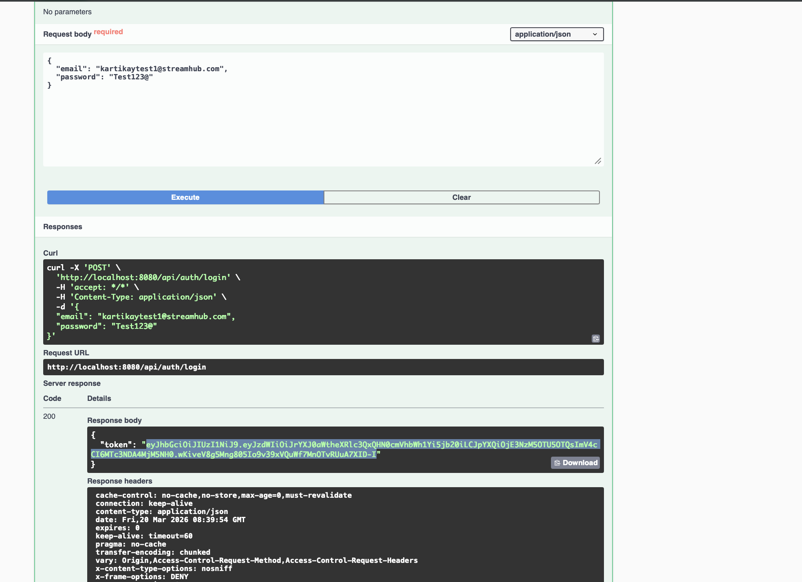
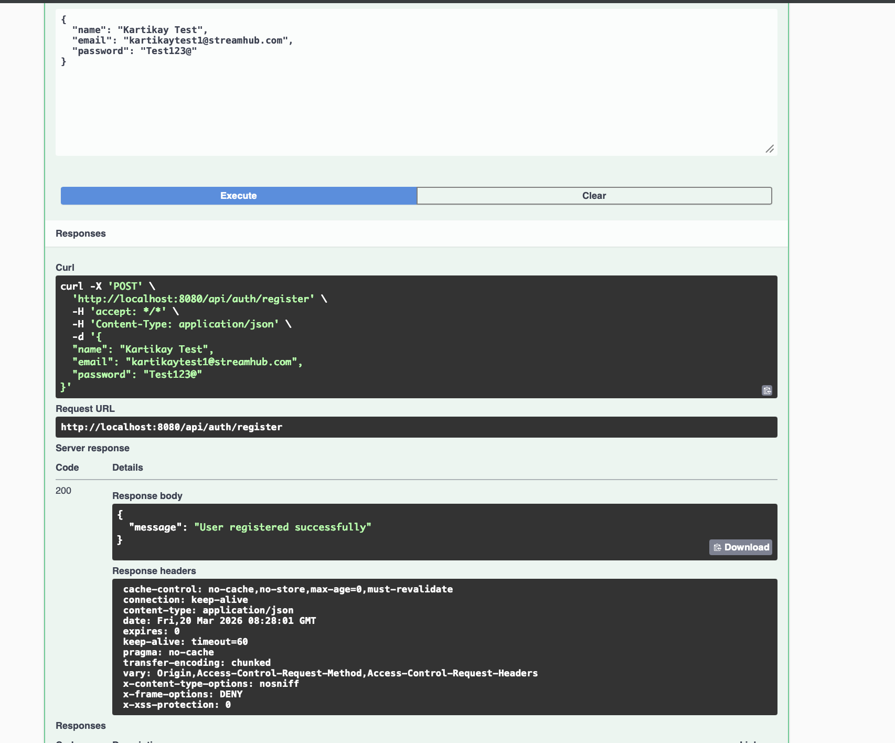
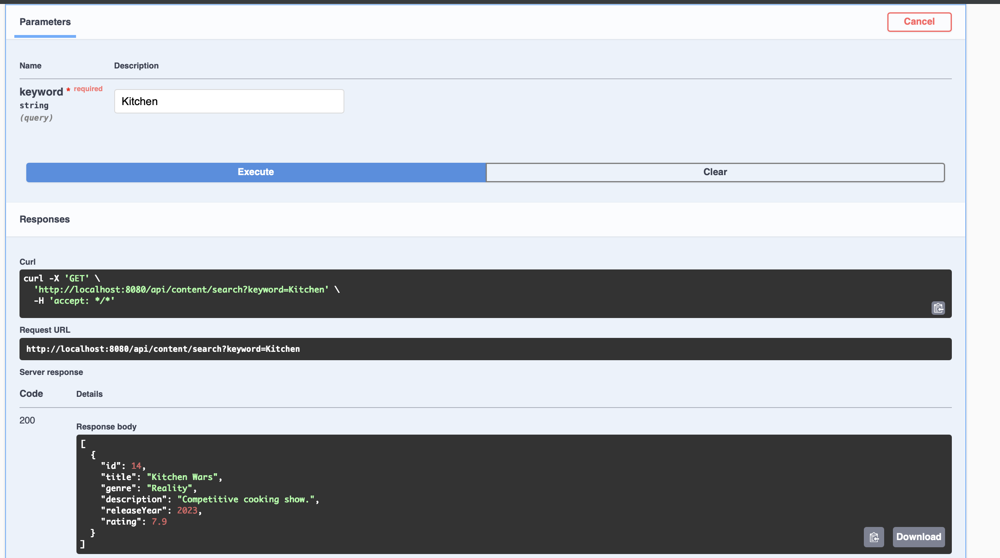
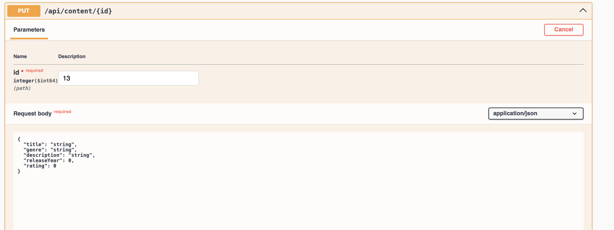
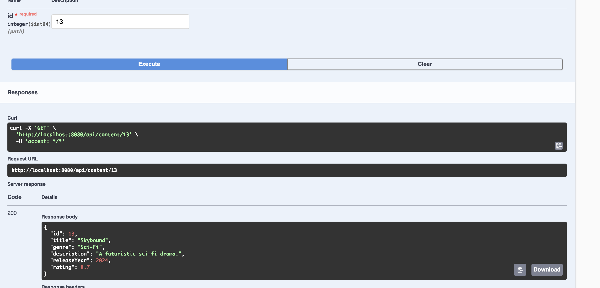

# StreamHub Backend

A Spring Boot backend for a subscription and content streaming platform featuring JWT authentication, MySQL integration, Swagger API documentation, content discovery, favorites, subscriptions, and watch history management.

## Tech Stack

- Java 17
- Spring Boot 3
- Spring Security
- JWT Authentication
- Spring Data JPA / Hibernate
- MySQL
- Maven
- Swagger / OpenAPI

## Features

- User registration and login with JWT-based authentication
- Role-based access control for admin and users
- Content management APIs
- Search content by title
- Filter content by genre
- Favorites management
- Subscription management
- Watch history tracking
- Swagger UI for API testing
- Seeded demo data using `data.sql`

## Project Structure

```bash
src/
 └── main/
     ├── java/com/kartikay/streamhub/
     │   ├── config/
     │   ├── controller/
     │   ├── dto/
     │   ├── entity/
     │   ├── exception/
     │   ├── repository/
     │   ├── security/
     │   └── service/
     └── resources/
         ├── application.yml
         └── data.sql
```
## API Modules
Auth Controller
Register user
Login user
Content Controller
Get all content
Get content by ID
Search content by keyword
Filter content by genre
Create, update, and delete content for admin users
Subscription Controller
Manage user subscriptions
User Controller
Manage favorites
Manage watch history
Admin Controller
Admin-only operations and dashboard endpoints

## Screenshots








## Highlights
Fixed Maven and JDK compatibility issues by enforcing Java 17
Added Swagger-based API validation
Integrated JWT authentication and authorization
Implemented relational data model with MySQL
Seeded reusable demo data for backend testing

## Future Improvements
Add a React frontend for full-stack interaction
Add Docker support for easier deployment
Add integration tests for controllers and security flows
Improve admin analytics/dashboard capabilities
Add pagination and sorting for content APIs

## Author
Kartikay Gupta
